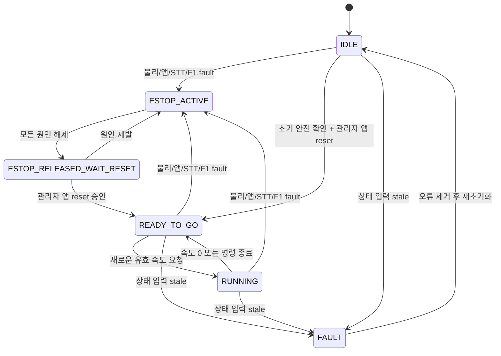

# MDROBOT E-stop 통합 개발 방향

## 1. 문서 목적

이 문서는 `mdrobot_can_control` 패키지의 현재 소스를 기준으로 물리 버튼, 관리자 앱,
STT 긴급어 입력을 하나의 소프트웨어 E-stop 경로로 통합하기 위한 개발 방향을 정의한다.

핵심 목표는 다음과 같다.

```text
물리 버튼 + 관리자 앱 + STT 긴급어
→ emergency_stop_node
→ /emergency_stop
→ safety_supervisor_node
→ /cmd_vel_safe
→ mdrobot_can_keyboard_knob_node
→ MDROBOT CAN motor
```

이 문서는 목표 구조와 검증 기준을 설명한다. 문서에 적힌 목표를 현재 구현 완료 상태로
간주하지 않는다.

## 2. 표기 규칙

| 표기 | 의미 |
| --- | --- |
| `CURRENT` | 현재 작업 트리의 코드에 존재하는 동작 |
| `GAP` | 관련 코드는 있지만 연결, launch 또는 계약이 불완전한 상태 |
| `BROKEN` | 현재 producer와 consumer 계약이 맞지 않아 실행 경로가 실패하는 상태 |
| `TARGET` | 앞으로 구현하고 검증할 목표 구조 |
| `TBD` | 실기기 시험 또는 제품 결정 전에는 확정하면 안 되는 항목 |

## 3. 안전 경계

이 패키지의 E-stop은 ROS 2와 CAN 명령을 사용하는 소프트웨어 정지 계층이다. 인증된
물리 비상정지 회로나 모터 전원·토크 차단 장치를 대체하지 않는다.

다음 상황에서는 소프트웨어만으로 정지를 보장할 수 없다.

- Jetson 또는 운영 컴퓨터 전체 정지
- CAN 인터페이스 고장
- motor node 정지 뒤 드라이버가 마지막 속도 명령을 계속 유지하는 경우
- MDROBOT 드라이버가 0 RPM 명령을 정상 반영하지 않는 경우
- ROS 네트워크 지연 또는 프로세스 스케줄링 지연

실제 사용자 운용 전에는 별도의 물리 전원·토크 차단 수단과 즉시 전원 차단 절차가
필요하다.

## 4. 현재 코드 기준선

### 4.1 `mdrobot_can_keyboard_knob_node`

상태: `CURRENT`

현재 작업 트리의 motor node는 다음 역할만 담당한다.

- `/cmd_vel_safe` 구독
- `cmd_timeout_sec` 초과 시 0 속도 처리
- MDROBOT F1의 knob1/knob2 수신
- knob1 비율로 허용 최고속도 제한
- 차동구동 속도를 MOT1/MOT2 RPM으로 변환
- CAN `PID_PNT_VEL_CMD` 송신
- F1 또는 속도 명령 timeout 시 0 RPM 처리

현재 motor node에는 다음 기능이 없다.

- `/emergency_stop` 구독
- F1 START/STOP 비트 기반 물리 버튼 판정
- motor 내부 E-stop latch
- `/estop_state` 발행
- `/estop_reset` 서비스
- E-stop 중 brake 또는 torque-off 반복 송신
- MDROBOT communication watchdog 설정

따라서 이전 코드와 문서의 “motor 내부 래치”를 현재 구현으로 표현하면 안 된다.

### 4.2 `emergency_stop_node`

상태: `CURRENT` 코드 존재 / `GAP` 운영 연결

현재 노드는 다음 입력을 수신하거나 읽을 수 있다.

| 입력 | 인터페이스 | 현재 의미 |
| --- | --- | --- |
| 관리자 앱 | `/app_emergency_stop` `std_msgs/Bool` | 앱의 소프트웨어 E-stop 요구 |
| STT | `/voice_emergency_stop` `std_msgs/Bool` | 긴급어 bridge의 제한 시간 pulse |
| 시험 입력 | `/emergency_stop_input` `std_msgs/Bool` | `test_topic` 모드에서 사용하는 시험 입력 |
| 물리 버튼 | MDROBOT CAN F1 | `can_f1` 모드에서 읽을 수 있는 START/STOP 입력 |

출력은 세 활성 입력의 OR 결과인 `/emergency_stop` `std_msgs/Bool`이다.

현재 launch는 `input_mode=test_topic`을 사용하므로 물리 F1 입력은 운영 경로에서
활성화되지 않는다. 모두 통합시킨 후 추후 시험입력은 삭제시킨다.

### 4.3 `safety_supervisor_node`

상태: `CURRENT`

현재 Safety Supervisor는 다음 인터페이스를 사용한다.

```text
/cmd_vel_req        → 원본 속도 요청
/emergency_stop     → 통합 E-stop 입력
/safety_reset       → reset 서비스
/cmd_vel_safe       → 최종 승인 속도
/safety_state       → 문자열 상태
```

현재 상태는 다음과 같다.

| 상태 | 의미 |
| --- | --- |
| `IDLE` | 아직 reset이 승인되지 않은 초기 대기 |
| `ESTOP_ACTIVE` | E-stop 입력이 활성 상태 |
| `ESTOP_RELEASED_WAIT_RESET` | 원인 입력은 해제됐지만 관리자 reset 대기 |
| `READY_TO_GO` | reset 승인 후 새 속도 요청을 기다리는 상태 |
| `RUNNING` | 살아 있는 비영 속도 명령을 전달하는 상태 |
| `FAULT` | `/emergency_stop` 입력이 없거나 stale인 상태 |

`ESTOP_ACTIVE`, `ESTOP_RELEASED_WAIT_RESET`, `IDLE`, `FAULT`에서는
`/cmd_vel_safe`가 0이어야 한다.

### 4.4 `app_emergency_node`

상태: E-stop 활성화 `CURRENT` / reset `BROKEN`

현재 앱 활성화 경로는 다음과 같다.

```text
Flutter
→ /app_estop_activate
→ app_emergency_node
→ /app_emergency_stop=true
→ emergency_stop_node
```

현재 reset 구현은 motor의 `/estop_reset`을 호출한다. 최신 motor node에는 해당 서비스가
없으므로 현재 reset 경로는 성공할 수 없다.

또한 앱은 `/app_estop_state`만 구독한다. 물리 버튼 또는 STT로 발생한 E-stop은 이 토픽의
`active` 상태에 자동 반영되지 않으므로 관리자 팝업이 나타난다고 보장할 수 없다.

### 4.5 현재 launch 상태

`motor_safety_bringup.launch.py`에는 다음 문제가 있다.

- `emergency_stop_node`가 `test_topic` 모드로 실행됨
- 최신 motor node에 없는 `estop_bit_pressed_value` 파라미터를 motor node에 전달함
- `app_emergency_node`가 포함되지 않음
- STT의 `emergency_estop_bridge`는 다른 패키지 launch에서 별도로 실행됨
- 전체 종단 체인을 한 번에 검증하는 운영 launch가 없음

## 5. 확정할 목표 책임 분리

### 5.1 `emergency_stop_node`: 입력 집계

`emergency_stop_node`는 E-stop 입력의 유일한 집계 노드로 사용한다.

담당 책임:

- 물리 F1 입력 상태 수집
- 앱 E-stop 요구 수집
- STT E-stop pulse 수집
- 각 입력의 freshness 확인
- 활성 입력 OR 계산
- `/emergency_stop` 주기 발행
- 향후 앱과 진단 도구가 사용할 입력별 상태 발행

담당하지 않는 책임:

- motor CAN 속도 송신
- Nav2 goal 발행
- 이전 mission 자동 재개
- 관리자 인증
- 최종 reset 승인

### 5.2 `safety_supervisor_node`: 권위 있는 상태 머신

Safety Supervisor는 `/emergency_stop`을 받아 주행 허용 여부를 최종 결정한다.

담당 책임:

- E-stop 활성 시 즉시 0 속도 출력
- 입력 stale 시 `FAULT`와 0 속도 출력
- E-stop 원인 해제 후 `ESTOP_RELEASED_WAIT_RESET` 유지
- 관리자 reset 전 재출발 금지
- reset 시 원본 속도가 0인지 확인
- reset 승인 후에도 이전 속도 또는 goal 자동 재개 금지
- `/cmd_vel_safe`의 유일한 발행자 역할

### 5.3 `mdrobot_can_keyboard_knob_node`: 제한된 motor adapter

motor node는 Safety가 승인한 `/cmd_vel_safe`만 CAN으로 변환한다.

담당 책임:

- `/cmd_vel_safe` 이외의 일반 주행 명령을 구독하지 않음
- motor 명령 timeout
- knob 기반 최고속도 제한
- F1 knob timeout 시 0 RPM
- CAN 속도 송신 실패 기록
- 종료 시 0 RPM 송신 시도

motor node에 앱, STT, Mission 또는 Nav2 정책을 넣지 않는다.

## 6. 목표 입력 경로

### 6.1 물리 버튼

상태: `TARGET`

권장 경로는 `emergency_stop_node`가 별도 SocketCAN 수신 소켓으로 F1 프레임을 읽는
방식이다.

```text
MDROBOT F1 START/STOP 비트
→ emergency_stop_node(input_mode=can_f1)
→ physical_active
→ /emergency_stop
```

SocketCAN은 동일 CAN 인터페이스를 여러 수신 소켓이 관찰할 수 있다. motor node는 knob를,
E-stop node는 START/STOP 비트를 각각 해석할 수 있다. 단, 실제 장비에서 두 노드가 동시에
프레임을 안정적으로 받는지 반드시 확인한다.

물리 버튼이 해제돼 `physical_active=false`가 되어도 Safety는 즉시 주행 상태로 돌아가면
안 된다. `ESTOP_RELEASED_WAIT_RESET`에서 관리자 앱 reset을 기다린다.

### 6.2 관리자 앱

상태: `CURRENT` 활성화 / `TARGET` 통합 상태·reset

```text
관리자 앱 E-stop 버튼
→ /app_estop_activate
→ /app_emergency_stop=true
→ emergency_stop_node
→ /emergency_stop=true
```

앱 E-stop 요구는 reset 절차가 시작되기 전까지 true를 유지한다. 앱 연결이 끊어졌다고
자동으로 false로 전환하지 않는다.

### 6.3 STT 긴급어

상태: `CURRENT` 구성요소 존재 / `GAP` 통합 launch

```text
마이크
→ ros_emergency_node
→ /vica/emergency
→ emergency_estop_bridge
→ /voice_emergency_stop=true pulse
→ emergency_stop_node
→ /emergency_stop=true
```

STT 경로는 LLM 응답을 기다리지 않는다. hard-stop 키워드만 E-stop pulse를 발생시킨다.
pulse가 false로 복귀해도 Safety는 관리자 reset 전까지 주행을 허용하지 않는다.

Push-to-talk STT가 `/vica/user_text`만 발행하는 경로는 그 자체로 E-stop 체인을 보장하지
않는다. 운영 시 상시 긴급어 감시 노드와 bridge가 반드시 함께 실행돼야 한다.

### 6.4 LLM 권한 경계

상태: `TARGET` 불변 규칙

LLM은 E-stop 활성화 또는 비활성화 권한을 갖지 않는다. 긴급어는 STT 결과에 대한 규칙
기반 필터가 LLM 호출 전에 감지하며, 정지 요청은 전용 `/vica/emergency` 경로로 전달한다.

다음 발화는 LLM 해석 결과만으로 Safety 상태를 변경하면 안 된다.

- “정지 해제”
- “다시 출발해”
- “계속 가”
- “괜찮으니 움직여”

음성으로 reset하거나 이전 goal을 재개하는 기능은 구현하지 않는다. LLM은 현재 Safety
상태를 안내하거나 관리자 앱 reset이 필요하다고 설명할 수만 있다.

## 7. `/emergency_stop` 의미

`/emergency_stop`은 “현재 하나 이상의 정지 요구 원인이 활성인가”를 나타내는 level
신호로 사용한다.

```text
emergency_stop = physical_active OR app_active OR voice_active OR input_fault
```

### 7.1 입력별 Bool 의미

| 입력 | `true` 의미 | `false` 의미 | 유지 방식 |
| --- | --- | --- | --- |
| `physical_active` | F1에서 물리 버튼 눌림 확인 | 물리 버튼 복귀 확인 | 버튼의 실제 level을 계속 반영 |
| `app_active` | 관리자 앱이 E-stop을 요구함 | 승인된 reset 절차가 앱 요구를 해제함 | reset 시작 전까지 true 유지 |
| `voice_active` | STT hard-stop 긴급어 pulse가 활성임 | pulse 제한시간 종료 | 짧은 pulse 후 false 복귀 |
| `input_fault` | F1 등 필수 안전 입력을 신뢰할 수 없음 | 입력 정상과 freshness 확인 | fault가 제거될 때까지 true 유지 |

각 Bool은 해당 입력 원인의 현재 상태만 나타낸다. 어느 입력의 `false`도 Safety reset이나
주행 허가를 의미하지 않는다.

### 7.2 물리 버튼 Bool 처리

물리 버튼은 CAN F1에서 읽은 값을 극성, packet index, bit mask, debounce, freshness 검사를
거쳐 `physical_active`로 변환한다.

```text
물리 버튼 눌림
→ physical_active=true
→ /emergency_stop=true
→ Safety ESTOP_ACTIVE

물리 버튼 복귀
→ physical_active=false
→ 다른 원인이 없으면 /emergency_stop=false
→ Safety ESTOP_RELEASED_WAIT_RESET
→ 관리자 앱 reset 전까지 /cmd_vel_safe=0
```

F1 프레임이 끊기거나 최신 상태인지 확인할 수 없으면 `physical_active=false`로 추정하지
않는다. `input_fault=true` 또는 동등한 fail-safe 상태로 처리한다.

### 7.3 앱 Bool 처리

앱 E-stop은 단순 ON/OFF 토글로 구현하지 않는다.

```text
앱 E-stop 활성화 요청
→ app_active=true
→ 연결이 끊어져도 true 유지

관리자 앱 reset 확인
→ reset 트랜잭션 시작
→ app_active=false 전환
→ 다른 source와 안전 조건 검사
→ /safety_reset
```

일반 화면 전환, 앱 종료, rosbridge 단절 또는 service timeout 때문에 `app_active=false`로
바뀌면 안 된다. reset이 중간에 실패하면 Safety는 계속 0 속도를 유지하고 앱에 실패 원인을
표시해야 한다.

### 7.4 STT Bool 처리

STT는 hard-stop 키워드를 감지하면 제한시간이 있는 `voice_active=true` pulse를 발생시킨다.
동일 발화가 반복 감지되면 pulse 시간을 연장할 수 있다.

```text
STT hard-stop 감지
→ voice_active=true
→ /emergency_stop=true
→ Safety ESTOP_ACTIVE

pulse 종료
→ voice_active=false
→ 다른 원인이 없으면 /emergency_stop=false
→ Safety ESTOP_RELEASED_WAIT_RESET
```

`voice_active=false`는 “음성 정지 방아쇠가 끝났다”는 뜻이다. 음성 reset 또는 재출발 허가가
아니다. 래치 유지는 Safety 상태 머신이 담당한다.

### 7.5 통합 상태와 reset 분리

다음 두 개념을 반드시 분리한다.

| 구분 | 소유자 | 의미 |
| --- | --- | --- |
| 입력 요구 상태 | `emergency_stop_node` | 현재 정지 원인이 하나 이상 활성인지 표시 |
| 주행 허가 상태 | `safety_supervisor_node` | reset 조건을 검사하고 `/cmd_vel_safe` 출력 여부 결정 |

목표 흐름은 다음과 같다.

```text
하나 이상의 입력이 true
→ /emergency_stop=true
→ ESTOP_ACTIVE
→ /cmd_vel_safe=0

모든 입력이 false
→ /emergency_stop=false
→ ESTOP_RELEASED_WAIT_RESET
→ /cmd_vel_safe=0 유지

관리자 앱 reset 승인
→ 안전 조건 검사
→ READY_TO_GO
→ 이전 명령이 아닌 새로운 명령만 허용
```

### 7.6 불변 안전 규칙

- `true`는 즉시 정지를 요구한다.
- `false`는 원인 신호가 해제됐다는 의미다.
- `false`는 reset 성공을 의미하지 않는다.
- `/emergency_stop=false`만으로 `/cmd_vel_safe`에 비영 명령이 나오면 안 된다.
- Safety 상태 머신이 reset latch를 소유한다.
- 물리 버튼 해제만으로 자동 재출발하지 않는다.
- STT pulse 종료만으로 자동 재출발하지 않는다.
- 앱 연결 종료나 통신 단절을 E-stop 해제로 해석하지 않는다.
- LLM 출력으로 E-stop을 해제하거나 reset하지 않는다.
- reset 뒤 이전 Nav2 goal과 마지막 속도 명령을 자동 재사용하지 않는다.
- 과거 motor latch 상태를 `/emergency_stop` 입력에 다시 OR하면 reset 교착이 생길 수 있다.

## 8. 물리 F1 판정 규칙

상태: `TBD`

현재 관찰 기록은 다음과 같다.

```text
해제 예: F1 00 58 58 ...
눌림 예: F1 00 48 48 ...
검사 비트: data[2], data[3]의 0x10
기본 active value: 0x00
```

현재 `emergency_stop_node`는 두 검사 바이트가 모두 active value일 때 true를 반환하는
AND 조건을 사용한다. 이전 motor 코드는 둘 중 하나만 active여도 true가 되는 OR 조건을
사용했다.

다음 실측 전에는 AND 또는 OR를 최종 계약으로 확정하지 않는다.

| 시험 | 기대 기록 |
| --- | --- |
| 버튼 완전 해제 | D2/D3 원본 값과 bit4 |
| 물리 버튼 1만 누름 | D2/D3 원본 값과 bit4 |
| 물리 버튼 2만 누름 | D2/D3 원본 값과 bit4 |
| 두 버튼 모두 누름 | D2/D3 원본 값과 bit4 |
| 케이블 단절 | F1 timeout 발생 여부 |
| 드라이버 재부팅 | 기동 직후 F1 상태와 첫 정상 프레임 시간 |

안전 기본 원칙은 하나의 실제 정지 버튼만 눌러도 정지하는 것이다. 장비가 두 입력을 하나의
버튼으로 동시에 변경하는 구조인지, 서로 독립된 버튼인지 실측 결과로 결정한다.

## 9. E-stop 상태 전이

목표 상태 전이는 다음과 같다.



E-stop 발생 당시의 Nav2 goal과 속도 명령은 폐기한다. reset 뒤 이전 goal이나 마지막 속도를
자동 재개하지 않는다.

## 10. 관리자 앱 전용 reset

### 10.1 제품 정책

상태: `TARGET`

reset은 관리자가 앱에서 E-stop 팝업 또는 알림을 확인한 뒤 명시적으로 승인하는 방식만
운영 경로로 제공한다.

- 물리 버튼 해제만으로 자동 reset하지 않음
- STT pulse 종료만으로 자동 reset하지 않음
- rosbridge 재연결만으로 자동 reset하지 않음
- node 재시작만으로 자동 reset하지 않음
- 이전 Nav2 goal 자동 재개 금지

### 10.2 앱에 필요한 공통 상태

현재 `/app_estop_state`는 앱 자체 요구만 나타낸다. 목표 구조에서는 앱이 권위 있는 Safety
상태를 구독해야 한다.

최소 상태 필드는 다음과 같다.

```text
state                 # ESTOP_ACTIVE / ESTOP_RELEASED_WAIT_RESET / ...
physical_active
app_active
voice_active
input_fault
reset_allowed
reason
timestamp
```

초기 구현에서는 기존 문자열 또는 JSON bridge를 사용할 수 있지만, ROS 내부 장기 계약은
typed custom message를 권장한다.

### 10.3 reset 승인 조건

단일 reset 오케스트레이터는 다음 조건을 모두 확인해야 한다.

1. 관리자 인증 세션이 유효함
2. 물리 버튼이 해제 상태임
3. F1 입력이 최신 상태임
4. 앱 E-stop 요구를 안전한 순서로 false 전환할 수 있음
5. STT pulse가 종료됐음
6. `/emergency_stop=false`가 최신 상태임
7. `/cmd_vel_req`가 0이거나 timeout 상태임
8. 활성 Nav2 goal이 취소됐음
9. Safety가 `ESTOP_RELEASED_WAIT_RESET` 또는 초기 reset 가능 상태임

조건이 하나라도 실패하면 reset을 거부하고 원인을 앱에 표시한다.

### 10.4 reset 트랜잭션

```text
관리자 앱 reset 확인
→ 앱 E-stop 요구 해제 요청
→ 모든 E-stop source 비활성 확인
→ Nav2 goal 취소 재확인
→ /cmd_vel_req=0 확인
→ /safety_reset 호출
→ Safety 상태 READY_TO_GO 확인
→ 앱 팝업 종료
→ 이전 goal은 폐기된 상태 유지
```

현재 `app_emergency_node`가 호출하는 `/estop_reset`은 이 목표에서 제거하거나 내부 호환
계층으로만 제한해야 한다. 최신 motor node에는 `/estop_reset` 서비스가 없다.

### 10.5 “앱에서만 reset”의 보안 의미

앱 UI에서만 버튼을 숨기는 것으로는 reset 권한을 제한할 수 없다. `/safety_reset`이 일반
ROS graph에 공개되어 있으면 다른 node나 CLI에서도 호출할 수 있다.

실제 관리자 앱 전용 권한을 보장하려면 다음 중 하나 이상이 필요하다.

- 인증된 backend/gateway만 내부 reset 서비스를 호출
- rosbridge 인증과 접근 제어
- SROS2 enclave 및 service 권한 정책
- 외부 서비스와 내부 `/safety_reset`의 namespace·권한 분리

최종 보안 방식은 앱 배포 환경과 네트워크 구성 확인 후 확정한다.

## 11. 목표 launch 구성

### 11.1 package 내부 안전 bringup

목표 package launch는 최소 다음 세 노드를 함께 실행한다.

```text
emergency_stop_node
├─ input_mode=can_f1
├─ can_iface=can1
├─ F1 판정 파라미터
└─ /emergency_stop 주기 발행

safety_supervisor_node
├─ /cmd_vel_req 구독
├─ /emergency_stop 구독
├─ /safety_reset 제공
└─ /cmd_vel_safe 발행

mdrobot_can_keyboard_knob_node
├─ /cmd_vel_safe 구독
├─ F1 knob 수신
└─ CAN RPM 송신
```

`app_emergency_node`를 같은 launch에 포함할지는 전체 앱 bringup 책임과 함께 결정한다.
어느 launch에 위치하든 운영 bringup에서 누락되면 안 된다.

### 11.2 외부 의존 노드

다음 노드는 다른 package에 있지만 전체 E-stop 통합에 필요하다.

- `vica_mission_manager/emergency_estop_bridge`
- `vica-voice-llm`의 상시 긴급어 감시 노드
- 앱 rosbridge
- Nav2 goal 취소를 담당하는 Mission Manager 또는 reset orchestrator

### 11.3 launch 검증 항목

- 같은 node가 두 launch에서 중복 실행되지 않음
- CAN F1 monitor 활성화 명령이 장비에 문제를 일으키지 않음
- 두 CAN 수신 소켓이 동일 F1 프레임을 안정적으로 관찰함
- `/cmd_vel` 직접 motor consumer가 없음
- motor의 유일한 속도 입력이 `/cmd_vel_safe`임
- Nav2 최종 속도 출력이 `/cmd_vel_req`로 연결됨
- `app_emergency_node`가 존재하지 않는 `/estop_reset`을 기다리지 않음

## 12. 장애 시 동작

| 장애 | 목표 동작 |
| --- | --- |
| F1 미수신 | `/emergency_stop=true`, Safety `ESTOP_ACTIVE` 또는 `FAULT` |
| `emergency_stop_node` 종료 | Safety가 stale 감지, `/cmd_vel_safe=0` |
| Safety Supervisor 종료 | `/cmd_vel_safe` 중단, motor cmd timeout으로 0 RPM |
| motor node 종료 | 마지막 CAN 명령 위험 존재, driver watchdog/물리 차단 필요 |
| rosbridge 단절 | 로봇 정지 상태 유지, reset 불가 |
| 앱 종료 | 활성 앱 E-stop 요구 유지 정책 필요 |
| STT bridge 종료 | 음성 E-stop 불가 상태를 diagnostics와 앱에 표시 |
| Nav2 취소 실패 | Safety 출력 0 유지, reset 거부 또는 명확한 경고 |
| E-stop 원인 재발 | reset 과정 중단, `ESTOP_ACTIVE` 복귀 |

## 13. 개발 단계

### 단계 0: 계약 고정

- 이 문서의 CURRENT/GAP/TARGET 구분 검토
- `/emergency_stop`의 level 의미 확정
- F1 AND/OR 판정 실측 계획 승인
- 관리자 앱 단일 reset 정책 확정
- 공통 Safety 상태 메시지 형식 결정

완료 기준:

- 세 입력과 소비자의 topic/service 표가 하나로 확정됨
- 자동 reset 금지가 모든 문서에 동일하게 기록됨

### 단계 1: 물리 입력 집계

- `emergency_stop_node`의 `can_f1` 모드 사용
- F1 극성 및 AND/OR 판정 단위 테스트
- F1 timeout fail-safe 테스트
- 앱·음성 입력과 OR 결합 테스트

완료 기준:

- 각 입력을 하나씩 활성화했을 때 `/emergency_stop=true`
- 입력이 동시에 들어와도 하나가 남아 있으면 true 유지
- F1 단절 시 false로 떨어지지 않음

### 단계 2: Safety 상태 통합

- `/emergency_stop` true/false와 Safety 상태 전이 검증
- E-stop 해제 뒤 `ESTOP_RELEASED_WAIT_RESET` 유지
- reset 전 `/cmd_vel_safe=0` 유지
- 입력 stale 시 `FAULT` 검증

완료 기준:

- 모든 E-stop source가 동일 Safety 상태 머신을 사용
- reset 전 비영 속도가 motor에 전달되지 않음

### 단계 3: 관리자 앱 알림과 reset

- 앱이 통합 Safety 상태를 구독
- 물리/STT E-stop에서도 팝업 또는 알림 표시
- source와 reset 불가 사유 표시
- 앱의 단일 reset 요청 구현
- 기존 `/estop_reset` 의존 제거

완료 기준:

- 세 입력 모두 앱에 동일한 E-stop 알림 생성
- 물리 버튼이 눌린 상태에서 reset 거부
- 관리자 reset 성공 뒤 READY_TO_GO 확인
- 이전 goal 자동 재개 없음

### 단계 4: 운영 launch

- package 안전 bringup 정리
- 앱 bridge와 voice bridge 포함 여부 명확화
- 개발용 stub 제외
- 토픽 remap과 node 중복 검사

완료 기준:

- 한 운영 절차로 필요한 노드를 재현 가능하게 실행
- 존재하지 않는 parameter/service 참조가 없음

### 단계 5: HIL 검증

- 바퀴를 띄운 상태에서 세 입력 종단 검증
- CAN 0 RPM 프레임 확인
- F1 단절, ROS node 종료, rosbridge 단절 시험
- reset 거부와 승인 조건 시험
- 제한 구역 저속 주행 시험

완료 기준:

- 시험 결과와 CAN 로그가 저장됨
- 실패 조건에서 재출발이 발생하지 않음
- 하드웨어 전원 차단 절차가 별도로 검증됨

## 14. 필수 테스트 행렬

| 번호 | 입력·조건 | 기대 `/emergency_stop` | 기대 Safety 상태 | 기대 motor 출력 | 앱 reset |
| --- | --- | --- | --- | --- | --- |
| T01 | 정상 기동 전 | fail-safe | `IDLE`/`FAULT` | 0 RPM | 조건 확인 전 거부 |
| T02 | 물리 버튼 누름 | true | `ESTOP_ACTIVE` | 0 RPM | 거부 |
| T03 | 물리 버튼 해제 | false | `ESTOP_RELEASED_WAIT_RESET` | 0 RPM | 허용 후보 |
| T04 | 앱 E-stop | true | `ESTOP_ACTIVE` | 0 RPM | 원인 해제 절차 후 허용 |
| T05 | STT hard-stop | true pulse | `ESTOP_ACTIVE` | 0 RPM | pulse 종료 전 거부 |
| T06 | 물리+STT 동시 | true | `ESTOP_ACTIVE` | 0 RPM | 모든 원인 해제 전 거부 |
| T07 | F1 단절 | true/fault | `ESTOP_ACTIVE`/`FAULT` | 0 RPM | 거부 |
| T08 | `/emergency_stop` stale | stale | `FAULT` | 0 RPM | 거부 |
| T09 | 비영 requested cmd 상태 reset | false | reset 대기 | 0 RPM | 거부 |
| T10 | 모든 조건 정상 후 관리자 reset | false | `READY_TO_GO` | 새 명령 전 0 RPM | 성공 |
| T11 | reset 뒤 이전 goal 확인 | false | `READY_TO_GO` | 0 RPM | 자동 재개 없음 |
| T12 | rosbridge 단절 | 기존 안전 상태 유지 | 변경 없음 | 안전 출력 유지 | 불가 |

## 15. 실기 검증 안전 조건

다음 조건을 갖추기 전에는 motor/CAN E-stop 시험을 실행하지 않는다.

1. 로봇 바퀴를 지면에서 띄움
2. 주변 사람과 물체 통제
3. 즉시 전원 차단 수단 확보
4. CAN frame ID와 좌우 motor mapping 재확인
5. F1 원본 프레임 기록 준비
6. 시험 담당자와 관찰 담당자 분리
7. reset 뒤 자동 재출발 여부를 확인할 감시 절차 준비

읽기 전용 확인을 먼저 수행하고 실제 E-stop/reset 및 속도 발행은 별도의 승인된 HIL
절차에서 수행한다.

## 16. 미확정 사항

다음 항목은 코드 변경 전에 결정하거나 실측해야 한다.

- F1 D2/D3 판정이 AND인지 OR인지
- 버튼 눌림 극성이 실제 장비에서도 `0`인지
- MDROBOT response CAN ID가 항상 `0x701`인지
- F1 publish 주기와 안전 timeout의 적절한 값
- motor node 종료 시 드라이버 communication watchdog 동작
- 0 RPM만 사용할지 brake/torque-off를 병행할지
- Safety 상태를 custom ROS message로 만들지 JSON bridge로 노출할지
- 앱 관리자 인증과 reset service 접근 제어 방식
- `app_emergency_node`를 이 package에 유지할지 별도 Safety package로 이동할지

## 17. 문서 동기화 대상

이 방향이 구현될 때 다음 문서와 계약을 함께 갱신한다.

- `guideline/vica_scenario.md`
- `guideline/vica_architecture.md`
- `guideline/bt와 visual hierarchy of your folders and files.md`
- `guideline/official_reference_urls.md`는 삭제하거나 다른 문서에 흡수하지 않음
- `AGENTS.md`의 안전 경로와 reset 지침

경로는 작업공간 루트 기준 상대경로로 기록하며 개인 절대경로를 추가하지 않는다.
